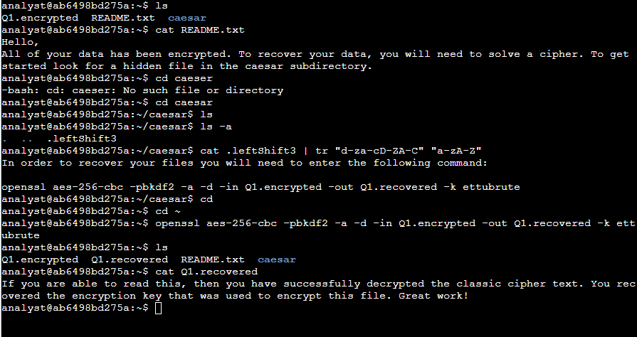

# Decrypt an Encrypted Message

**Course:** Course 4 – Tools of the Trade: Linux and SQL  
**Lab Focus:** Using Linux commands to find hidden files, break a Caesar cipher, and decrypt a file with OpenSSL

---

## Objective

All files in the home directory were encrypted. The goal was to recover the data by:

1. Reading the instructions in `README.txt`
2. Finding a hidden file containing a Caesar cipher
3. Decrypting the Caesar cipher to reveal the OpenSSL command
4. Using that command to decrypt the encrypted file and read the hidden message

---

## Tools & Commands Used

- `ls` / `ls -a` – list files (including hidden)
- `cd` – change directory
- `cat` – read file contents
- `tr` – translate characters (used to break the Caesar cipher)
- `openssl` – decrypt the AES-256 encrypted file

---

## Steps Performed

### 1. Explore the home directory and read instructions
```bash
ls
cat README.txt
2. Find and decrypt the hidden Caesar cipher file
Bashcd caesar
ls -a
cat .leftShift3 | tr "d-za-cD-ZA-C" "a-zA-Z"
cd ~
The decrypted message revealed the OpenSSL command needed for the next step.
3. Decrypt the encrypted file
Bashopenssl aes-256-cbc -pbkdf2 -a -d -in Q1.encrypted -out Q1.recovered -k ettubrute
4. Read the recovered message
Bashls
cat Q1.recovered
Recovered message:

“If you are able to read this, then you have successfully decrypted the classic cipher text. You recovered the encryption key that was used to encrypt this file. Great work!”

Screenshot

Key Takeaways

Hidden files in Linux start with a period (.) and are revealed with ls -a.
The Caesar cipher can be broken by shifting characters back using the tr command.
OpenSSL can decrypt AES-256-CBC encrypted files when the correct password/key is known.
Reading instruction files carefully is essential when recovering encrypted data.


Status
Lab completed successfully.
text


